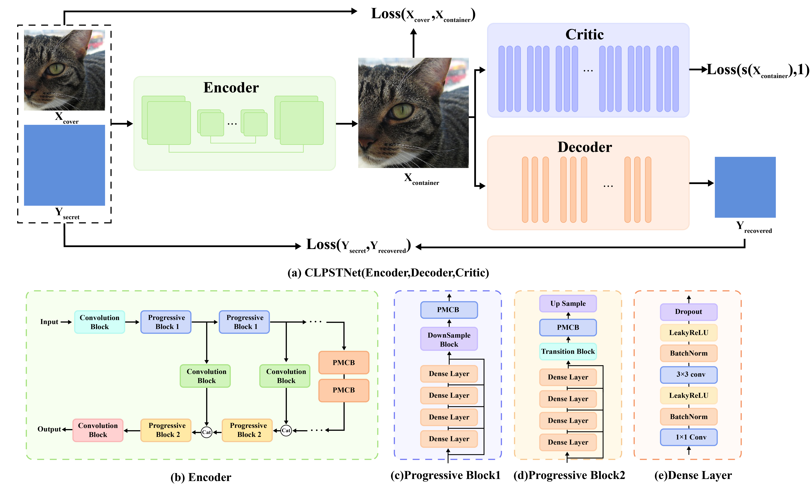
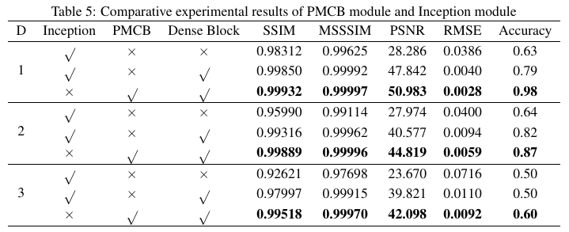
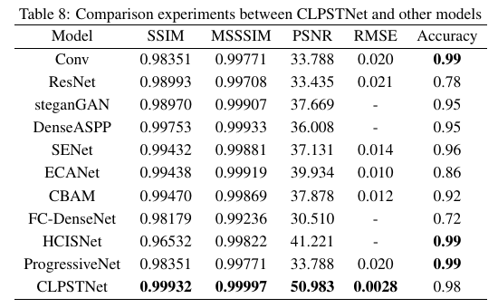
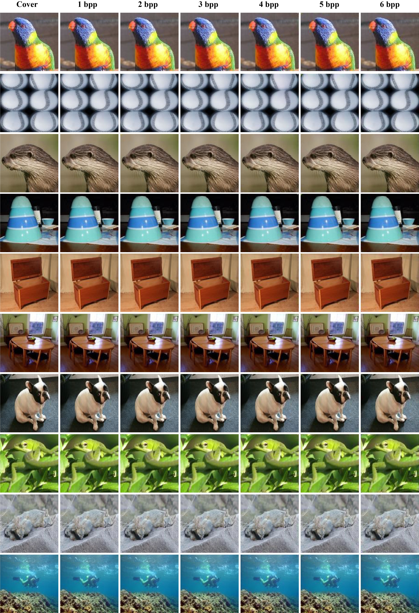

# CLPSTNet: A Progressive Multi-Scale Convolutional Steganography Model Integrating Curriculum Learning
Fengchun Liu; Tong Zhang; Chunying Zhang

This repository contains the official implementation of the paper "CLPSTNet: A Progressive Multi-Scale Convolutional Steganography Model Integrating Curriculum Learning".



## Introduction

CLPSTNet is a progressive multi-scale convolutional steganography network model that integrates curriculum learning. The network consists of multiple progressive multi-scale convolutional modules that integrate Inception structures and dilated convolutions. The module contains multiple branching pathways, starting from a smaller convolutional kernel and dilatation rate, extracting the basic, local feature information from the feature map, and gradually expanding to the convolution with a larger convolutional kernel and dilatation rate for perceiving the feature information of a larger receptive field, so as to realize the multi-scale feature extraction from shallow to deep, and from fine to coarse, allowing the shallow secret information features to be refined in different fusion stages.

The experimental results show that the proposed CLPSTNet not only has high PSNR, SSIM metrics and decoding accuracy on three large public datasets, ALASKA2, VOC2012 and ImageNet, but also the steganographic images generated by CLPSTNet have low steganalysis scores.

## Environment Setup

Our experimental environment is as follows:

- python: 3.10
- torch: 2.1.2
- CUDA Version: 12.4

Please run the following command to install dependency packages:
```bash
pip install -r requirement.txt
```


## Data Preparation
The model is trained and evaluated on three public datasets:VOC2012;ImageNet;ALASKA2
Default dataset used in the code. The directory structure should be:

```plaintext
../VOC2012/
├── train/
├── val/
└── test/
 ```


## Model Architecture
CLPSTNet consists of three main components:

- Encoder : Performs information hiding
- Decoder : Performs information recovery
- Critic : Evaluates the performance of the encoding network
### Progressive Multi-Scale Convolutional Block (PMCB)
The core of CLPSTNet is the Progressive Multi-Scale Convolutional Block (PMCB), which is implemented in the clpstnet.py file. 

### Encoder Network
The encoder network ( Encoder_Network in clpstnet.py ) is responsible for hiding secret information within the cover image. It uses a series of Progressive Multi-Scale Convolutional Blocks to gradually embed the secret data while maintaining the visual quality of the cover image.

### Decoder Network
The decoder network ( decode_Network in decoder.py ) extracts the hidden information from the stego image. It also uses a multi-scale architecture with various convolution branches to effectively recover the embedded secret data.

### Critic Network
The critic network ( XuNet in critic.py ) is designed to distinguish between cover images and stego images. It serves as an adversary during training, pushing the encoder to generate more imperceptible stego images.


## Training
To train the CLPSTNet model, run the main.py script:

```bash
python main.py
 ```

The training process includes the following steps:

1. Data Loading : Images are loaded from the specified dataset.
2. Secret Generation : Random binary data is generated as secret information to be hidden(D).
3. Forward Pass : The cover image and secret data are passed through the encoder to generate a stego image, which is then passed through the decoder to recover the secret.
4. Loss Calculation : Multiple loss functions are calculated:
   
   - Encoder Loss: Combines MSE, SSIM, and MS-SSIM to ensure visual quality
   - Decoder Loss: Binary cross-entropy to ensure accurate secret recovery
   - Adversarial Loss: From the critic network to improve steganographic security
5. Optimization : The model parameters are updated using Adam optimizer.


## Evaluation
To evaluate the trained model, use the val.py script:

```bash
python val.py
 ```

This script loads a trained model and evaluates it on the validation dataset, calculating:

- SSIM (Structural Similarity Index)
- PSNR (Peak Signal-to-Noise Ratio)
- MS-SSIM (Multi-Scale Structural Similarity Index)
- RMSE (Root Mean Square Error)
  
For generating sample stego images from the trained model, use the sample.py script:

```bash
python sample.py
 ```


## Results





## Citation

If you find our work useful in your research, please consider citing:	
 ```
@article{liu2025clpstnet,
  title={CLPSTNet: A Progressive Multi-Scale Convolutional Steganography Model Integrating Curriculum Learning},
  author={Liu, Fengchun and Zhang, Tong and Zhang, Chunying},
  journal={arXiv preprint arXiv:2504.16364},
  year={2025}
}
 ```

## Contact
If you encounter any issues while using this repository, please feel free to leave messages in issues or contact us at:

- zenozt@bupt.edu.cn
We will respond as soon as possible.
